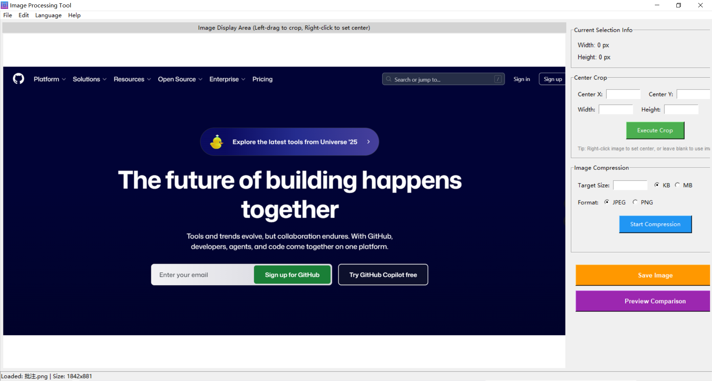
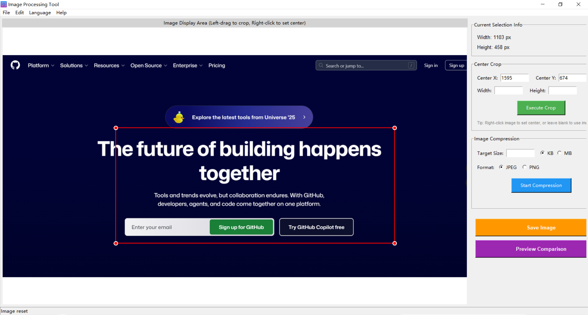
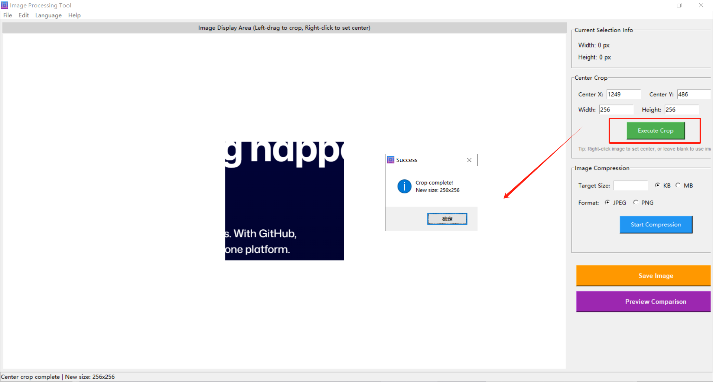
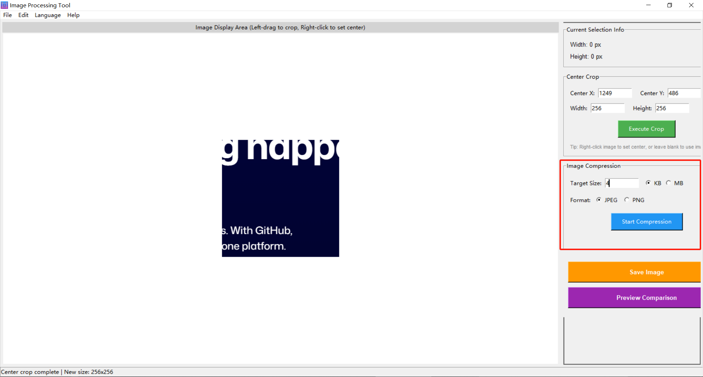
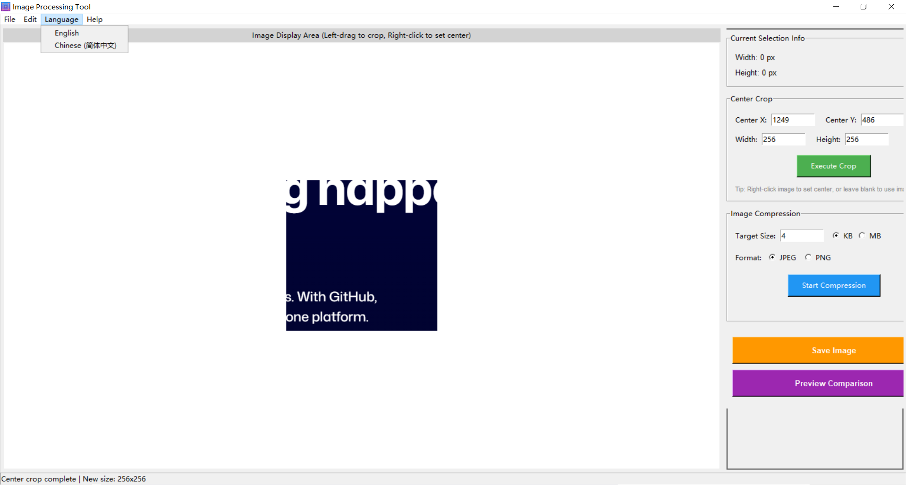
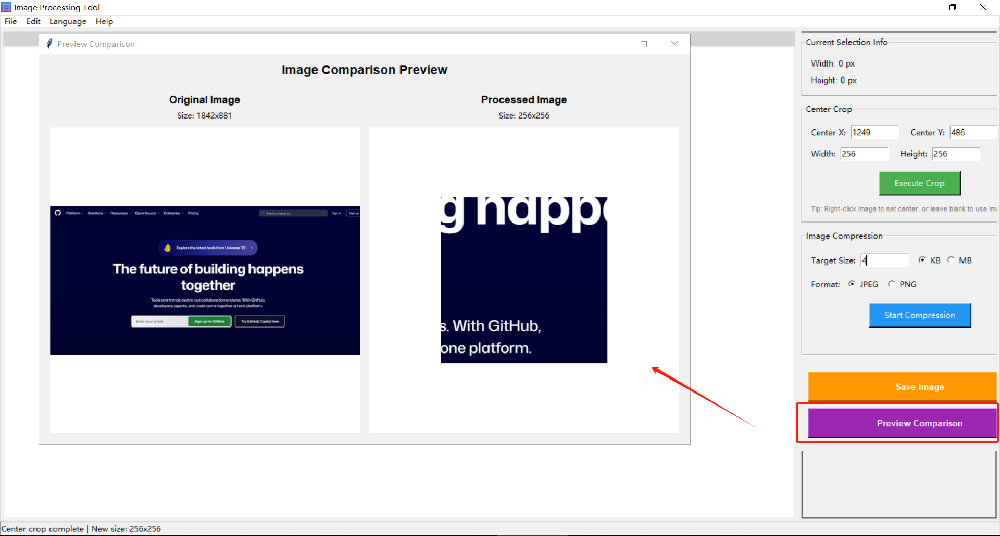

# 图像工具专业版

<div align="center">


**一款功能强大的桌面图像处理工具，支持交互式裁剪、智能压缩和多语言界面**

[English](README.md) | [简体中文](README-zh.md)

[下载](https://github.com/yourusername/image-tool-pro/releases) | [文档](docs/USER_GUIDE.md) | [反馈问题](https://github.com/yourusername/image-tool-pro/issues)

</div>

---

## 📖 概述

**图像工具专业版** 是一款用户友好的桌面应用程序，专为**快速高效的图像处理**而设计。无论您是需要**裁剪照片**的摄影师、为网页优化**图像**的设计师，还是准备社交媒体素材的内容创作者，这款工具都能简化您的工作流程。

使用 Python 和 Tkinter 构建，打包为**便携式 Windows 可执行文件** - 无需安装 Python！

### 为什么选择图像工具专业版？

- 🎯 **像素级精确控制** - 精确裁剪，实时显示尺寸
- 🗜️ **智能压缩** - 将图像压缩到精确的文件大小，同时保持质量
- 🌍 **多语言** - 支持中文和英文界面
- 💼 **专业且简单** - 直观界面中的强大功能
- 📦 **零安装** - 独立可执行文件，开箱即用

---

## ✨ 功能特性

### 🎨 交互式图像裁剪

直观的拖放界面，轻松裁剪图像：

- 鼠标拖动绘制裁剪区域
- 使用角点控制手柄调整裁剪边界
- 实时显示像素尺寸
- 拖动裁剪区域内部即可移动位置
- 红色裁剪框和控制点提供视觉反馈

### 🎯 中心点切割

基于自定义中心点的精确裁剪：

- 右键点击设置自定义中心点（蓝色十字标记）
- 输入精确的宽度和高度（像素）
- 自动处理超出边界的裁剪
- 如未指定，默认使用图像中心
- 非常适合创建缩略图和个人资料图片

### 🗜️ 智能图像压缩

使用智能优化将图像压缩到精确的文件大小：

- 指定目标文件大小（KB 或 MB）
- 支持 JPEG 和 PNG 格式
- 二分查找算法获得最佳质量
- 需要时自动缩放分辨率
- 在减小文件大小的同时保持视觉质量

### 🌍 多语言支持

无缝切换语言：

- 中文和英文界面
- 通过菜单轻松切换语言
- 持久化语言偏好设置
- 本地化帮助文档

### 🖥️ 桌面友好

原生 Windows 应用程序体验：

- 键盘快捷键（Ctrl+O、Ctrl+S）
- 直观的菜单系统
- 状态栏实时反馈
- 带自定义图标的专业窗口设计
- 流畅交互的响应式界面

### 📦 即开即用

无需麻烦，无需配置：

- 便携式可执行文件（约 11MB）
- 无需 Python 环境
- 无需安装
- 可从任何位置运行（U 盘、桌面等）
- 包含所有依赖项

---

## 🖼️ 屏幕截图

### 主界面


### 交互式裁剪实际操作


### 中心点切割功能




### 智能压缩结果


### 多语言界面


### 预览对比


---

## 📥 下载

### 最新版本: v1.0.0

**[⬇️ 下载 Windows 版图像工具专业版](https://github.com/yourusername/image-tool-pro/releases/latest)**

**系统要求：**
- Windows 7 或更高版本（64 位）
- 最低 512 MB 内存（推荐 1 GB）
- 50 MB 可用磁盘空间
- 最低显示分辨率 1024x768

### 安装

无需安装！只需：

1. 从[发布页面](https://github.com/yourusername/image-tool-pro/releases)下载 ZIP 文件
2. 解压到您想要的位置
3. 运行 `ImageProcessor.exe`
4. 开始处理图像！

---

## 🚀 快速开始

### 最终用户

1. **打开图像**
   - 点击 `文件 → 打开图片`（或按 `Ctrl+O`）
   - 选择 JPG、PNG、BMP 或 GIF 文件

2. **处理图像**
   - **裁剪**：左键点击并拖动以创建裁剪框
   - **中心切割**：右键点击设置中心，输入尺寸，点击"执行切割"
   - **压缩**：输入目标大小，选择格式，点击"开始压缩"

3. **保存作品**
   - 点击 `保存图片` 按钮（或按 `Ctrl+S`）
   - 选择保存位置和文件名

### 键盘快捷键

| 快捷键 | 操作 |
|----------|--------|
| `Ctrl+O` | 打开图片 |
| `Ctrl+S` | 保存图片 |
| `左键拖动` | 创建/调整裁剪框 |
| `右键点击` | 设置中心点 |

---

## 🛠️ 技术栈

- **语言**: Python 3.7+
- **GUI 框架**: Tkinter（内置）
- **图像处理**: Pillow 9.5.0
- **打包工具**: PyInstaller 5.13.2
- **架构**: MVC 模式，模块化设计

### 核心依赖

```
pillow>=10.0.0    # 图像处理库
```

就这样！Tkinter 包含在 Python 中，因此依赖项最少。

---

## 💻 开发

### 开发者

想要贡献或从源代码构建？以下是方法：

#### 前置要求

- Python 3.7 或更高版本
- pip（Python 包管理器）
- Git

#### 安装

```bash
# 克隆仓库
git clone https://github.com/yourusername/image-tool-pro.git
cd image-tool-pro

# 安装依赖
pip install -r requirements.txt

# 运行应用程序
python main.py
```

#### 构建可执行文件

```bash
# 安装 PyInstaller
pip install pyinstaller

# 使用提供的脚本构建
python build_exe.py

# 或使用批处理文件（Windows）
build_simple.bat

# 可执行文件将在 dist/ImageProcessor.exe
```

#### 项目结构

```
image-tool-pro/
├── main.py                # 应用程序入口点
├── src/
│   ├── app.py            # 主应用程序窗口
│   ├── image_processor.py # 图像处理逻辑
│   ├── crop_tool.py      # 交互式裁剪工具
│   ├── ui_components.py  # UI 组件部件
│   └── language.py       # 多语言支持
├── assets/
│   ├── icon.ico          # 应用程序图标
│   └── screenshots/      # README 截图
├── requirements.txt      # Python 依赖
└── build_exe.py         # PyInstaller 构建脚本
```

### 运行测试

```bash
# 运行核心功能测试
python test_core.py
```

---

## 🤝 贡献

欢迎贡献！无论是错误报告、功能请求还是代码贡献，我们都感谢您的帮助。

请阅读我们的[贡献指南](CONTRIBUTING.md)以开始。

### 贡献方式

- 🐛 通过[Issues](https://github.com/yourusername/image-tool-pro/issues)报告错误
- 💡 提出功能或改进建议
- 📖 改进文档
- 🌍 添加新语言的翻译
- 💻 提交拉取请求

---

## 📄 许可证

本项目采用 MIT 许可证 - 详见 [LICENSE](LICENSE) 文件。

```
版权所有 (c) 2025 图像工具专业版贡献者

特此免费授予任何获得本软件副本的人使用、修改和分发
本软件用于任何目的，包括商业应用。
```

---

## 🙏 致谢

- **[Pillow 团队](https://python-pillow.org/)** - 出色的图像处理库
- **[PyInstaller 团队](https://pyinstaller.org/)** - 独立可执行文件打包
- **Python 社区** - 惊人的生态系统和支持
- **所有贡献者** - 感谢您让这个项目变得更好！

---

## 📞 支持

### 获取帮助

- 📚 阅读[用户指南](docs/USER_GUIDE.md)
- ❓ 查看[常见问题](docs/FAQ.md)
- 🐛 在 [GitHub Issues](https://github.com/yourusername/image-tool-pro/issues) 上报告问题

### 保持更新

- ⭐ 为此仓库加星以表示您的支持
- 👀 关注更新和新版本
- 🔔 启用通知以获取重要公告

---

## 🗺️ 路线图

### 版本 1.1（即将推出）
- [ ] 批量处理支持
- [ ] 撤销/重做功能
- [ ] 处理历史记录
- [ ] 更多键盘快捷键

### 版本 1.2（计划中）
- [ ] 图像旋转和翻转工具
- [ ] 基本滤镜（模糊、锐化、亮度）
- [ ] 更多输出格式（WEBP、TIFF）
- [ ] 命令行界面

### 版本 2.0（未来）
- [ ] 高级滤镜和效果
- [ ] 水印功能
- [ ] 批量自动化脚本
- [ ] macOS 和 Linux 支持

---

## 📊 项目统计

- **代码行数**: 约 1,600
- **支持的语言**: 2（英文、中文）
- **翻译字符串**: 80+
- **构建大小**: 约 11 MB
- **支持的图像格式**: JPG、PNG、BMP、GIF

---

<div align="center">

**由图像工具专业版团队用心制作**

[⬆ 返回顶部](#图像工具专业版)

</div>
